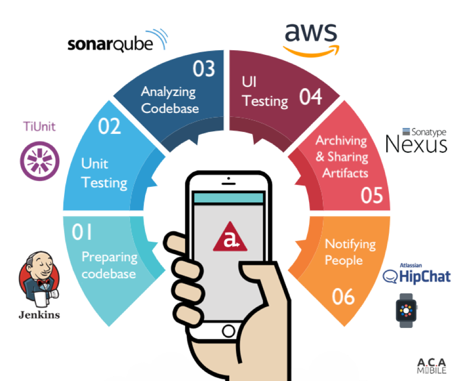

# Some build automation tools
## Jenkins, Terraform, Docker, Gradle, Puppet, Chef

# The benefits of build automation
**Improves Quality**
 Build automation assists your QA team in moving faster. That means you can find errors faster and mitigate them to enhance the quality of your product and avoid bad builds.
**Boost Productivity**
 Build automation makes sure faster feedback. This means your software developers improve productivity. 
**Accelerates Delivery**
 Build automation aids you in speeding up delivery. That’s because it removes redundant tasks and guarantees you find problems faster, so you can launch faster.
**Retains a Complete History**
 Build automation maintains a thorough history of files and modifications. That means you can easily track glitches back to their source.
**Saves Money and Time** 
Build automation saves money and time. That is why build automation sets you up for CI/CD, accelerates delivery, enhances productivity, and improves quality. 

#  The challenges and problems with implementing build automation
**Complexity in Setup:**
 Configuring build automation tools and defining build processes can be complex, especially for large projects with multiple dependencies and technologies. 

**Maintenance Overhead:** 
Build scripts and configurations require regular maintenance to keep them up to date with changes in the project. This can lead to additional overhead and effort. 

**Integration Challenges:** 
Integrating build automation into existing development workflows and toolchains can be challenging and may require significant changes to the current processes.

**Learning Curve:**
 Developers and teams may need to learn new tools and technologies to effectively implement build automation, which can lead to a steep learning curve and initial productivity slowdown.
 
