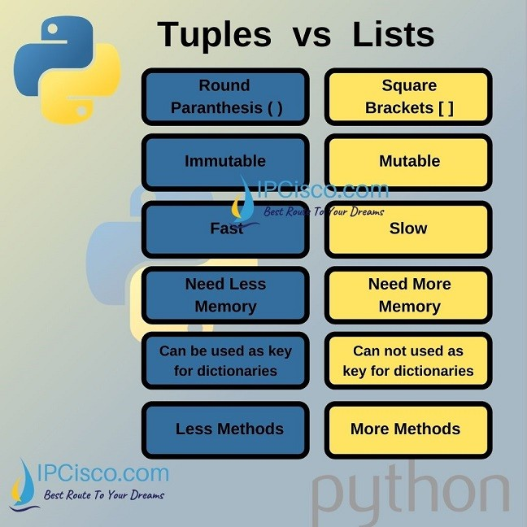
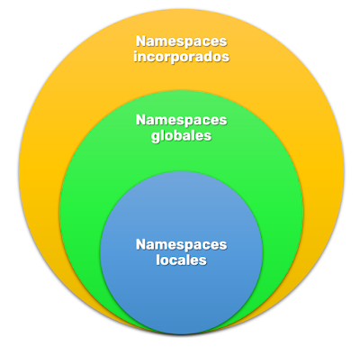
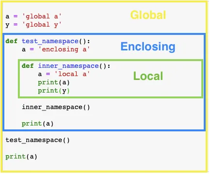
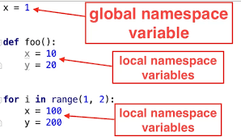
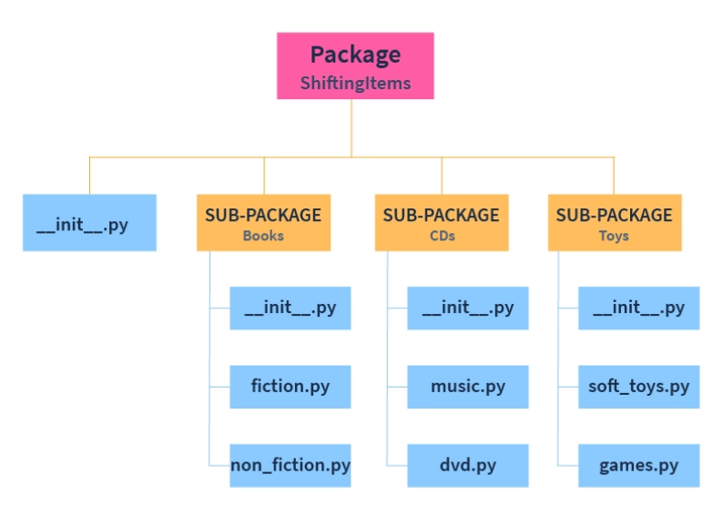
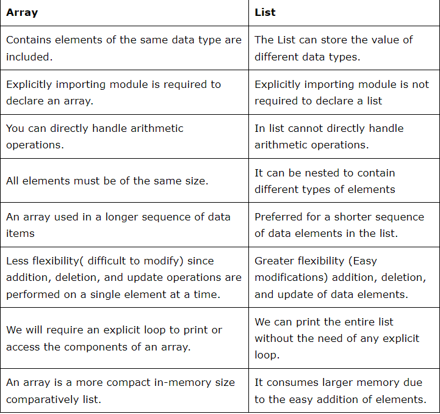
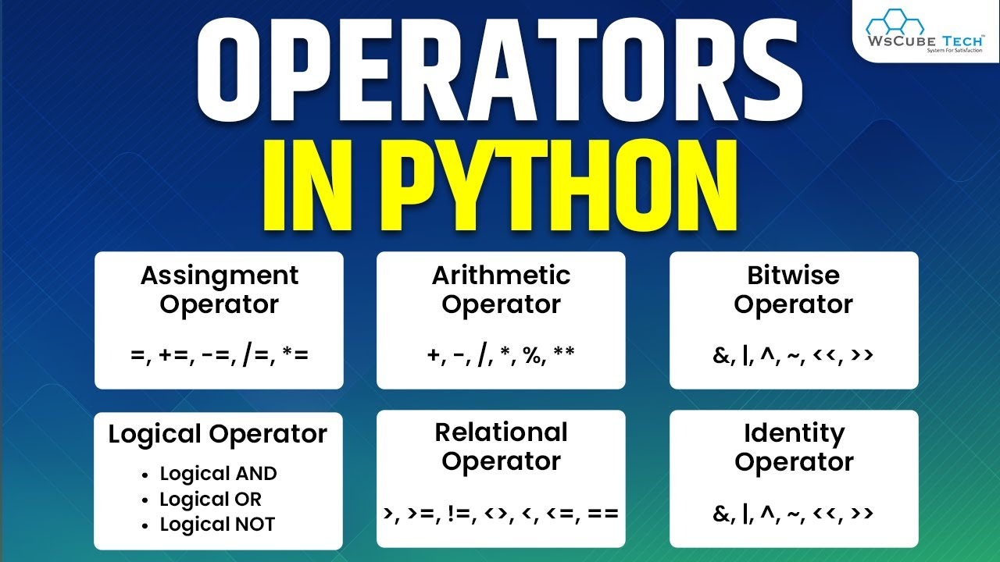

# 1.Define a list and tuplein Python. Provide some examples.
List is a group of comma-separated values within square brackets and square brackets are mandatory.
l = [45, 75, 69, 12, 48, 1, 24, 71]
a = [‘sdf’, ‘abc’, ‘qwe’]
b = [“Python”, “Java”, 200, 32.787]
Tuple is a group of comma-separated values within parenthesis and parenthesis is optional.
tuple1 = (32. 67, 15, 89, 94, 74, 1, 24, 17)
tuple2 = ('abc', 'pqr', 'xyz')
tuple3 = ("Python", "Java", 200, 34.567)

# 2.What is a namespacein Python?
 A namespace is a collection of currently defined symbolic names along with information about the object that each name references.
 
 
# 3.What is the difference between a local variable and a global variable?
Local variables are defined inside a function or block, whereas global variable is defined outside of all functions or blocks.

# 4.What is an IDE? Mention some common IDEs that could be used with Python.
IDE is a software application that helps programmers develop software code efficiently.

# 5.What are modulesin Python? Provide some examples.
Module is a file that contains code to perform a specific task. A module may contain variables, functions, classes etc
import math

# 6.What is the difference between an arrayand a list?
 List can store elements of different types, but arrays can store elements only of the same type.
 

# 7.What are operators? 
Operators are special symbols, combinations of symbols, or keywords that designate some type of computation. You can combine objects and operators to build expressions that perform the actual computation. So, operators are the building blocks of expressions, which you can use to manipulate our data.

