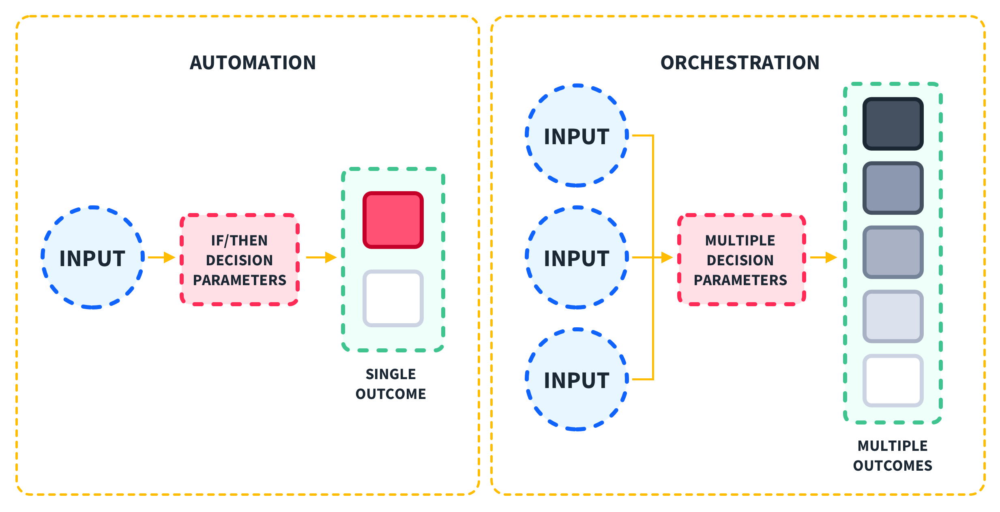
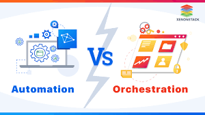

# Look out for the following keywords and try to determine if they belong to automation (A), orchestration (O), or both (B), and why?

**Management**	 	                             B	   Orchestration involves the management and coordination  of multiple automated tasks to achieve a complex process.
**Python Script**	               A	 	          Automation often involves writing scripts to automate specific tasks, and Python is a common scripting language used for this purpose.
**Provisioning**	               A          	       Provisioning (setting up infrastructure) is typically an automated task handled by tools like Ansible, Puppet, or Terraform.
**Code**	                       A	 	           Writing code is fundamental to automation, as scripts and programs are used to automate tasks.
**Single task**	                   A	 	 	       Automation often focuses on performing a single task efficiently.
**Process Coordination**	      	       O	 	   Orchestration coordinates multiple automated tasks into a cohesive workflow or process.
**Infrastructure**	               A	 	 	       Automating the provisioning and management of infrastructure is a common use case for automation tools.
**HCL Configuration Language**     A	 	 	       HashiCorp Configuration Language (HCL) is used with Terraform, an automation tool for provisioning infrastructure.
**Eliminate repetition**	       A	 	 	       One of the primary goals of automation is to eliminate repetitive tasks.
**User-defined function**	       A	 	 	       Automation often involves creating user-defined functions to handle specific tasks within scripts or programs.
**Increase reliability**	            	    B  Both automation and orchestration aim to increase the reliability of processes by reducing human error and ensuring consistent execution.
**Terraform**	                   A	 	 	       Terraform is a tool specifically for automating the provisioning of infrastructure.
**Version control**                     	    B      Both automation scripts and orchestration configurations benefit from version control to manage changes and maintain consistency.
**Unit test**	                   A	 	 	       Unit testing is part of the automation of testing code to ensure it functions as expected.
**Decrease IT cost**                    	    B	   Both automation and orchestration help decrease IT costs by improving efficiency and reducing the need for manual intervention.
**Thread creation**                A	 	 	       Automating tasks often involves creating threads for concurrent execution.
**Decrease friction among teams**	 	O	 	       Orchestration helps coordinate tasks across different teams, reducing friction and improving collaboration.
**Increase productivity**	                    B	   Both automation and orchestration increase productivity by streamlining processes and reducing manual effort.
**PyCharm**	                       A	 	 	       PyCharm is an IDE commonly used for writing and automating Python scripts.
**Workflow**	 	                    O	 	       Orchestration involves creating and managing workflows that coordinate multiple automated tasks into a unified process.

### Christiana
### Mohammad
### Ubongabasi
### Stuart
### Shaza